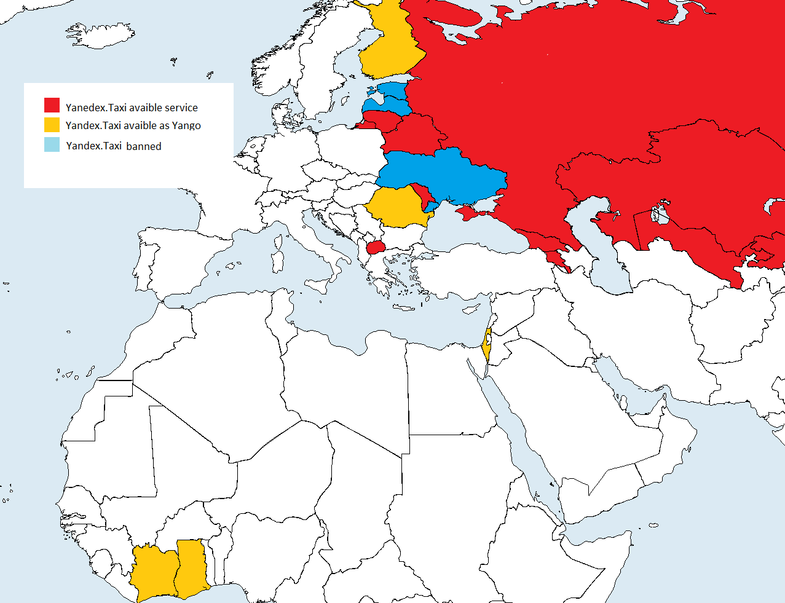

# Highload taxi service

## Содержание
1. [Тема и целевая аудитория](#тема-и-целевая-аудитория)
2. [Расчет нагрузки](#расчет-нагрузки)
3. [Глобальная балансировка](#глобальная-балансировка)

## Тема и целевая аудитория

Аналог на рынке - Яндекс Такси

### функционал MVP
пассажирам:
- регистрация и авторизация
- заказ такси
- отслеживание местоположение авто
- оплата заказа 
- оценивание поездки (CSAT)

водителям:
- начало/завершение поездки

### Целевая аудитория
- 47.4 млн MAU [^1]
- половина пользователей заказывают такси лишь раз в месяц, в среднем пользователь делает 6 поездок в месяц [^2]
- средняя продолжительность поездки - 26 минут [^2]
- доступность сервиса - СНГ и [EMEA](https://ru.wikipedia.org/wiki/EMEA), 35% заказов вне РФ [^1]

Карта доступности Яндекс Такси в странах

## Расчет нагрузки

### Продуктовые метрики
Годовой прирост пользователей - 7.2 млн [^1] [^5], 0.6 млн в месяц.

MAU - 47.2 млн [^1], DAU - 9 млн (20% MAU)

Средний размер хранилища пользователя
| тип                                             | размер |
| ----------------------------------------------- | ------ |
| Данные пользователя: Имя, почта, пароль, прочее | 1кб    |
| Аватар                                          | 1мб    |
| Адреса                                          | 3кб    |

Итого 1мб и 4кб на пользователя

Количество действий по пользователям в день:
- 0.2 поездки в день (6 в месяц)
- 0.1 оплата поездки (половина пользователей платят вне сервиса, например переводом)
- 0.1 отправка обратной связи по поездке (половина пользователей оставляет обратную связь)
- аналогично водителями совершается 0.2 поездки в день (на одного клиента)

### Технические метрики

Возьмем в расчет 150 млн зарегистрированных пользователей. 
Предположим, что каждый второй пользователь имеет аватар, в половине поездок оставляется обратная связь.

В месяц совершается 47.2*6 = 283.2млн поездок.

Хранилище по типам:
| тип                                             | размер на пользователя     | прирост в месяц | всего на 150 млн пользователей |
| ----------------------------------------------- | -------------------------- | --------------- | ------------------------------ |
| Данные пользователя: Имя, почта, пароль, прочее | 1кб                        | 6.9гб           | 143гб                          |
| Аватар                                          | 1мб                        | 3.45тб          | 71.5тб                         |
| Адреса                                          | 3кб                        | 20.6гб          | 439гб                          |
| Обратная связь (CSAT)                           | 1кб на одну обратную связь | 135гб           | -                              |
| История поездок                                 | 1кб на поездку             | 270гб           | -                              |
| **Сумма**                                       | **минимум 1мб и 4кб**      | **3.85тб**      | **минимум 71.92тб**            |

RPS:
| Запрос                | RPS                                                       | расчет                                                                                                                                                                                                                                 |
| --------------------- | --------------------------------------------------------- | -------------------------------------------------------------------------------------------------------------------------------------------------------------------------------------------------------------------------------------- |
| Заказ такси           | 109                                                       | (6 заказов в месяц * 47.2млн MAU) / (30 дней * 24 час * 3600 сек) = 109RPS                                                                                                                                                             |
| Оплата поездки        | 54.5                                                      | RPS заказов / 2                                                                                                                                                                                                                        |
| Обратная связь (CSAT) | 54.5                                                      | RPS заказов / 2                                                                                                                                                                                                                        |
| Авторизация           | 18                                                        | Предположим, что кука живет месяц, 47.2млн MAU / (30 дней * 24 час * 3600 сек) = 18 RPS                                                                                                                                                |
| Регистрация           | 0.22                                                      | Прирост 7.2 млн пользователей в год, 7.2 / (365\*24\*3600) = 0.22RPS                                                                                                                                                                   |
| Просмотр профиля      | 109                                                       | Равен RPS заказов, если пользователь просматривает профиль водителя перед каждой поездкой                                                                                                                                              |
| Отправка геолокации   | 39333                                                     | Среднее время поездки 26 минут [^2], среднее время ожидания 4 минуты, пусть данные отправляются каждые 5 секунд (12 раз в секунду), итого ((26 + 4) * 12 * 47.2млн MAU * 6 поездок в месяц) / (30 дней * 24 час * 3600 сек) = 39333RPS |
| **Сумма**             | 39672.22, бОльшая часть приходится на отправку геолокации |                                                                                                                                                                                                                                        |

Трафик:
| тип                | потребление в среднем                                                                 | потребление в пике | сумма за сутки |
| ------------------ | ------------------------------------------------------------------------------------- | ------------------ | -------------- |
| API                | Считая 1 кб на запрос, 1кб * 39672 RPS = **0.3 Гбит/с**                               | 0.9 Гбит/с         | 25'920 Гбит    |
| Статика (Аватарки) | Считая 1мб на аватарку и 109 RPS на просмотр профиля, 1мб * 109 RPS = **0.85 Гбит/с** | 2.55 Гбит/с        | 73'440 Гбит    |

В пике - вечером пятницы и субботы количество заказов составляет ~2.12 [^2] [^6], с запасом можно взять множитель 3.

## Глобальная балансировка

### Расположение ДЦ
Основываясь на карте доступности Яндекс Такси в странах мира:

Так как большинство пользователей из России, в ней следует расположить наибольшее число ДЦ, конкретно набоильшей плотностью населения обладает центральная часть Росии, соответственно ДЦ должны располагаться в Москве и Санкт-Петербурге, для покрытия всей остальной части России следует расположить ДЦ в Новосибирске. Чтобы увеличить доступность сервиса в странах бывшего СССР с южной стороны России, можно расположить ДЦ в Астане.

Для покрытия Европы можно разместить ДЦ в Франкфурте и/или Амстердаме, запросы из северной Европы можно будет направлять в ДЦ из Петербурга.

Чтобы учесть пользователей из Африки можно поставить ДЦ в Лаосе или ОАЭ.

### Методы балансировки
- DNS Балансировка: Использование Latency-based DNS (например Amazon Route 53) позволит отправлять запрос в ближайший ДЦ, независимо от страны и региона.
- Балансировка между ДЦ: Использование BGP Anycast с метрикой минимальных хопов позволит выбрать наиболее подходящий ДЦ

## Источники

[^1]: [Финансовые результаты Яндекса за 4 квартал 2023](https://ir.yandex.ru/financial-releases?year=2023&report=q4)
[^2]: [Исследование Яндекса о такси в Москве за 2015](https://yandex.ru/company/researches/2015/moscow/taxi)
[^3]: [Среднесуточное количество поездок в московских такси 2020](https://tass.ru/moskva/9251913)
[^4]: [Яндекс.Такси - Википедия](https://ru.m.wikipedia.org/wiki/%D0%AF%D0%BD%D0%B4%D0%B5%D0%BA%D1%81.%D0%A2%D0%B0%D0%BA%D1%81%D0%B8)
[^5]: [Финансовые результаты Яндекса за 4 квартал 2022](https://ir.yandex.ru/financial-releases?year=2023&report=q4)
[^6]: [Исследование Яндекса о такси в Санкт-Петербурге за 2015](https://yandex.ru/company/researches/2015/spb/taxi)
