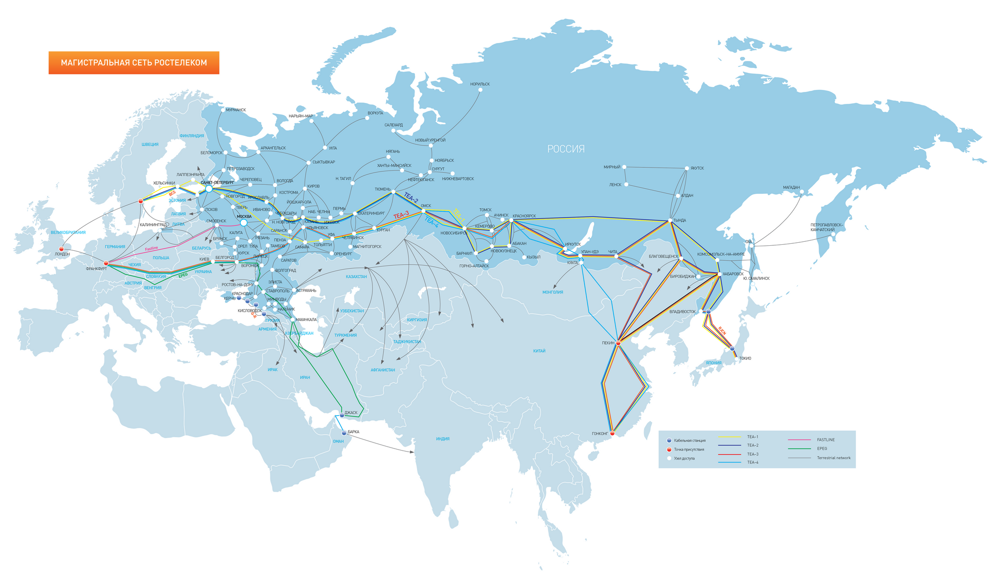

# Highload taxi service

## Содержание
1. [Тема и целевая аудитория](#тема-и-целевая-аудитория)
2. [Расчет нагрузки](#расчет-нагрузки)
3. [Глобальная балансировка](#глобальная-балансировка)

## Тема и целевая аудитория

Аналог на рынке - Яндекс Такси

### функционал MVP
пассажирам:
- регистрация и авторизация
- заказ такси
- отслеживание местоположение авто
- оплата заказа 
- оценивание поездки (CSAT)

водителям:
- начало/завершение поездки

### Целевая аудитория
- 47.4 млн MAU [^1]
- половина пользователей заказывают такси лишь раз в месяц, в среднем пользователь делает 6 поездок в месяц [^2]
- средняя продолжительность поездки - 26 минут [^2]
- доступность сервиса - СНГ и [EMEA](https://ru.wikipedia.org/wiki/EMEA), 35% заказов вне РФ [^1]

Карта доступности Яндекс Такси в странах

## Расчет нагрузки

### Продуктовые метрики
Годовой прирост пользователей - 7.2 млн [^1] [^5], 0.6 млн в месяц.

MAU - 47.2 млн [^1], DAU - 9 млн (20% MAU)

Средний размер хранилища пользователя
| тип                                             | размер |
| ----------------------------------------------- | ------ |
| Данные пользователя: Имя, почта, пароль, прочее | 1кб    |
| Аватар                                          | 1мб    |
| Адреса                                          | 3кб    |

Итого 1мб и 4кб на пользователя

Количество действий по пользователям в день:
- 0.2 поездки в день (6 в месяц)
- 0.1 оплата поездки (половина пользователей платят вне сервиса, например переводом)
- 0.1 отправка обратной связи по поездке (половина пользователей оставляет обратную связь)
- аналогично водителями совершается 0.2 поездки в день (на одного клиента)

### Технические метрики

Возьмем в расчет 150 млн зарегистрированных пользователей. 
Предположим, что каждый второй пользователь имеет аватар, в половине поездок оставляется обратная связь.

В месяц совершается 47.2*6 = 283.2млн поездок.

Хранилище по типам:
| тип                                             | размер на пользователя     | прирост в месяц | всего на 150 млн пользователей |
| ----------------------------------------------- | -------------------------- | --------------- | ------------------------------ |
| Данные пользователя: Имя, почта, пароль, прочее | 1кб                        | 6.9гб           | 143гб                          |
| Аватар                                          | 1мб                        | 3.45тб          | 71.5тб                         |
| Адреса                                          | 3кб                        | 20.6гб          | 439гб                          |
| Обратная связь (CSAT)                           | 1кб на одну обратную связь | 135гб           | -                              |
| История поездок                                 | 1кб на поездку             | 270гб           | -                              |
| **Сумма**                                       | **минимум 1мб и 4кб**      | **3.85тб**      | **минимум 71.92тб**            |

RPS:
| Запрос                | RPS                                                        | расчет                                                                                                                                                                                                                                                                                                                                                              |
| --------------------- | ---------------------------------------------------------- | ------------------------------------------------------------------------------------------------------------------------------------------------------------------------------------------------------------------------------------------------------------------------------------------------------------------------------------------------------------------- |
| Заказ такси           | 109                                                        | (6 заказов в месяц * 47.2млн MAU) / (30 дней * 24 час * 3600 сек) = 109RPS                                                                                                                                                                                                                                                                                          |
| Оплата поездки        | 54.5                                                       | RPS заказов / 2                                                                                                                                                                                                                                                                                                                                                     |
| Обратная связь (CSAT) | 54.5                                                       | RPS заказов / 2                                                                                                                                                                                                                                                                                                                                                     |
| Авторизация           | 18                                                         | Предположим, что кука живет месяц, 47.2млн MAU / (30 дней * 24 час * 3600 сек) = 18 RPS                                                                                                                                                                                                                                                                             |
| Регистрация           | 0.22                                                       | Прирост 7.2 млн пользователей в год, 7.2 / (365\*24\*3600) = 0.22RPS                                                                                                                                                                                                                                                                                                |
| Просмотр профиля      | 109                                                        | Равен RPS заказов, если пользователь просматривает профиль водителя перед каждой поездкой                                                                                                                                                                                                                                                                           |
| Отправка геолокации   | 39'333*2=78'666                                            | Среднее время поездки 26 минут [^2], среднее время ожидания 4 минуты, пусть данные отправляются каждые 5 секунд (12 раз в секунду), итого ((26 + 4) * 12 * 47.2млн MAU * 6 поездок в месяц) / (30 дней * 24 час * 3600 сек) = 39333RPS, результат следует умножить на 2, так как не только клиент водителя отправляет геолокацию, но и клиент пассажира получает ее |
| **Сумма**             | 79'005.22, бОльшая часть приходится на отправку геолокации |                                                                                                                                                                                                                                                                                                                                                                     |

В пике - вечером пятницы и субботы количество заказов составляет ~2.12 [^2] [^6], с запасом можно взять множитель 3.

Трафик по типам:
RPS:
| Запрос                | потребление в среднем | потребление в пике | сумма за сутки | расчет                             |
| --------------------- | --------------------- | ------------------ | -------------- | ---------------------------------- |
| Заказ такси           | 0.83мбит/c            | 2.5мбит/c          | 0.07гбит       | 54.5 RPS * 1кб = 0.44мбит/c        |
| Оплата поездки        | 0.4мбит/с             | 1.2мбит/c          | 0.03гбит       | 54.5 RPS * 1кб = 0.44мбит/c        |
| Обратная связь (CSAT) | 0.4мбит/с             | 1.2мбит/c          | 0.03гбит       | 54.5 RPS * 1кб = 0.44мбит/c        |
| Авторизация           | 0.14мбит/c            | 0.42мбит/c         | 0.01гбит       | 18 RPS * 1кб = 0.14мбит/c          |
| Регистрация           | 1.6кбит/c             | 4.8мбит/c          | 0.13гбит       | 0.22 RPS * 1кб = 1.6кбит/c         |
| Просмотр профиля      | 0.87гбит/c            | 2.61гбит/c         | 73тбит         | 109 RPS * (1мб и 1кб) = 0.87гбит/c |
| Отправка геолокации   | 50.4мбит/c            | 151.2мбит/c        | 4.15тбит       | см. ниже                           |

Так как передача данных о геопозиции имеет высокий RPS (78'666 RPS), передавать подобные данные по протоколу HTTP(S) через модель запрос-ответ было бы неэффективно.
Для этого можно использовать протокол websocket, который обеспечивает дуплексную связь клиента и сервера.
Данные с GPS обычно представляют широту, долготу, высоту над уровнем моря [^7], также можно получить информацию о точности описанных ранее данных.
Каждый из этих параметров представляет собой вещественное число размером 8 байт, итого 8*4=32 байта, с запасом можно взять 40.
Заголовки TCP/IP пакета весят 40 байт [^9].
Заголовки одного фрейма ("сообщения"), переданного по websocket составляют 4 байта [^8].
В сумме получается минимально одно сообщение о геолокации будет размером 84 байта.
Итого 78'666 RPS * 84 байта = 50.4мбит/c.

## Глобальная балансировка

### Расположение ДЦ
Основываясь на карте доступности Яндекс Такси в странах мира:

а также карте плотности населения России и Европы:

а также карте интернет кабелей:

Следует расположить ДЦ в таких крупных точках как Москва и Санкт-Петербург, в данных районах наибольшая плотность населения.
Также эти ДЦ смогут обслуживать восточную и северную Европу. 
Для покрытия всей остальной части России и стран бывшего СССР с южной стороны, нужно поставить ДЦ в Новосибирске, через него проходят крупные интернет кабели.

Описанных трех точек будет хватать для достаточно быстрого обслуживания клиентов во всех необходимых районах.
Чтобы подтвердить это была проведена проверка rtt утилитой ping через сервисы looking glass [^10] в разных районах, полученная информация приведена в табице:

| Путь                                    | средний rtt, ms |
| --------------------------------------- | --------------- |
| Актау (Казахстан) - Москва              | 40              |
| Актау (Казахстан) - Санкт-Петербург     | 50              |
| Хельсинки (Финляндия) - Москва          | 17              |
| Хельсинки (Финляндия) - Санкт-Петербург | 14              |
| Бухарест (Румыния) - Москва             | 51              |
| Вильнюс (Литва) - Москва                | 13              |
| Минск (Беларусь) - Москва               | 14              |
| Новосибирск - Владивосток               | 73              |
| Новосибирск - Петропавловск-Камчатский  | 62              |
| Новосибирск - Якутск                    | 59              |

Все значения rtt в пределах 100 мс, наибольшее время показывают дальневосточные регионы России, однако там наиболее меньшая плотность населения.

### Методы балансировки
- DNS Балансировка: Использование Latency-based DNS позволит отправлять запрос клиентов в ближайшему по времени отклика ДЦ независимо от их местоположения.
- Балансировка между ДЦ: Использование BGP Anycast с метрикой минимальных хопов позволит выбрать наиболее подходящий ДЦ и распределить трафик между узлами. Так как с некоторым округлением можно сказать, что ДЦ будут расположены в двух точках: Москва+Санкт-Петербург и Новосибирск, данный способ более подходит для балансировки между Москвой и Санкт-Петербургом, потому что они они расположены рядом, Новосибирск же находится далеко и тут уже вполне подойдет DNS балансировка как более эффективный и дешевый метод. Однако, объединение Новосибирска и Москвы+Санкт-Петербург в единую подсеть возможно не с целью уменьшения задержек, а с целью получения возможности избытка трафика (при очень высокой загруженности) в Новосибирск. 

## Источники

[^1]: [Финансовые результаты Яндекса за 4 квартал 2023](https://ir.yandex.ru/financial-releases?year=2023&report=q4)
[^2]: [Исследование Яндекса о такси в Москве за 2015](https://yandex.ru/company/researches/2015/moscow/taxi)
[^3]: [Среднесуточное количество поездок в московских такси 2020](https://tass.ru/moskva/9251913)
[^4]: [Яндекс.Такси - Википедия](https://ru.m.wikipedia.org/wiki/%D0%AF%D0%BD%D0%B4%D0%B5%D0%BA%D1%81.%D0%A2%D0%B0%D0%BA%D1%81%D0%B8)
[^5]: [Финансовые результаты Яндекса за 4 квартал 2022](https://ir.yandex.ru/financial-releases?year=2023&report=q4)
[^6]: [Исследование Яндекса о такси в Санкт-Петербурге за 2015](https://yandex.ru/company/researches/2015/spb/taxi)
[^7]: [GPS - Википедия](https://en.wikipedia.org/wiki/Global_Positioning_System#:~:text=The%20receiver%27s%20Earth%2Dcentered%20solution%20location%20is%20usually%20converted%20to%20latitude%2C%20longitude%20and%20height%20relative%20to%20an%20ellipsoidal%20Earth%20model)
[^8]: [The WebSocket Protocol - RFC 6455](https://datatracker.ietf.org/doc/html/rfc6455#section-5.2)
[^9]: [Header size considerations](https://www.oreilly.com/library/view/internet-core-protocols/1565925726/ch07s01s05s04.html#:~:text=Taken%20together%2C%20most%20TCP%2FIP,from%20IP%20and%20TCP%20each).)
[^10]: [looking house](https://looking.house/)
